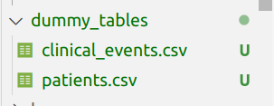
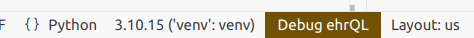
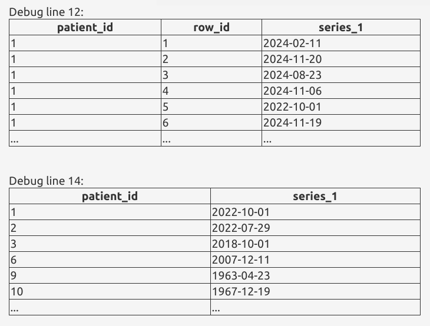

## What is dummy data?

Dummy data (in the context of OpenSAFELY) is data that mimics the output of a dataset produced by running an ehrQL generate-dataset action, in the absence of the real data. It allows you to test and develop your analyses without access to the real data.

When you run an ehrQL command or a `project.yaml` action locally (i.e. outside of the secure 
environment where real patient data lives), ehrQL allows the action to run using simulated data, either
data generated by ehrQL itself, or data that you provide.

## Using dummy data in OpenSAFELY

There are 3 ways to use dummy data:

1. Allow ehrQL to generate a dummy dataset from your dataset definition
1. Provide your own dummy tables
1. Provide your own dummy dataset


### Generate a dummy dataset with ehrQL

:fontawesome-solid-code: `analysis/ehrql_dataset_definition.py`

This example is a very minimal dataset definition, which finds patients between
18 and 80, and adds their age, sex and date of their first clinical event to the output
dataset:

```py
from ehrql import create_dataset
from ehrql.tables.core import patients, clinical_events

dataset = create_dataset()

age = patients.age_on("2020-03-31")
first_event_date = clinical_events.sort_by(clinical_events.date).first_for_patient().date

dataset.define_population((age > 18) & (age < 80))
dataset.age = age
dataset.sex = patients.sex
dataset.first_event_date = first_event_date
```

:octicons-terminal-16: Try generating a dummy dataset. In the terminal, run:

```sh
opensafely exec ehrql:v1 generate-dataset analysis/ehrql_dataset_definition.py
```

!!! info "`opensafely exec` vs `opensafely run`"
    We will be using `opensafely exec` for this part of the workshop. This lets us
    run ehrQL commands as standalone actions. Refer to the documentation on
    [running ehrQL](https://docs.opensafely.org/ehrql/explanation/running-ehrql/)
    for more information.


By default, this generates 10 patients and will print them to the terminal:

```bash
patient_id,age,sex,first_event_date
1,29,unknown,2022-10-02
2,24,male,2022-07-30
3,58,unknown,2018-10-02
6,29,unknown,2007-12-12
9,61,intersex,1963-04-24
10,57,male,1967-12-20
11,69,female,2023-09-02
14,76,unknown,2007-10-16
15,23,male,1999-06-27
17,25,unknown,2019-08-14
```

Note that all 10 patients have been generated with ages within the expected range (18-80, as defined in the dataset definition) and sex in one of the 4 possible values.

???+ example "Update the dataset definition"

    Try updating the dataset definition to filter to only female patients. Rerun the `generate-dataset` command, and confirm that the output dataset now contains 10 female patients.

:fontawesome-solid-code: If you want to produce a different number of patients, you can configure your dummy data by adding:


```py
dataset.configure_dummy_data(population_size=50)
```

???+ example "Change population size"
    Try re-running the `generate-dataset` command above, but with a different population size.

??? "Writing datasets to a file instead of the terminal"
    In this workshop, we are letting erhQL just print the dummy dataset it generates to the
    terminal. If you want to output the dataset as a file instead, you can pass an output argument, e.g.
    ```sh
    opensafely exec ehrql:v1 generate-dataset ... --output output/dataset.csv
    ```

### Characteristics of native dummy data in OpenSAFELY

Dummy data produced from a dataset definition is:

- **structurally valid**
    - it will contain the correct columns, as defined in the dataset definition
    - data in each column will be of the correct type
    - where a column contains categorical data, the column values will respect the categories.  These could be categories that are built into ehrQL's definition of the underlying table (e.g. sex in the previous example) or they could be defined in the dataset definition using the `case`
  function.

- **logically valid**
    - it will respect logic within the dataset definition itself.
    - e.g., it won't produce a clinical event date before a patient's date of birth or after their date of death.

- **consistent**
    - the generated dataset will be the same across multiple runs of the same dataset definition
    - although the data generated is random, it is "seeded", which means that the same data will be generated each time.

???+ example "Check dummy datasets are logically valid"
    :fontawesome-solid-code: try this out by adding to `analysis/ehrql_dataset_definition.py`:

    ```py
    from ehrql.tables.core import patients, clinical_events
    ...
    dataset.after_dob = first_event_date > patients.date_of_birth
    dataset.before_dod = (first_event_date < patients.date_of_death) | patients.date_of_death.is_null()
    ```

    These two additional variables will return True (T) if the clinical event is within
    the patient's lifespan.

    Generate the dataset again and confirm that event dates are always after the patient's
    date of birth and before their date of death.

    :octicons-terminal-16:
    ```sh
    opensafely exec ehrql:v1 generate-dataset analysis/ehrql_dataset_definition.py

    ...
    patient_id,age,sex,first_event_date,after_dob,before_dod
    1,29,unknown,2022-10-02,T,T
    2,24,male,2022-07-30,T,T
    3,58,unknown,2018-10-02,T,T
    6,29,unknown,2007-12-12,T,T
    9,61,intersex,1963-04-24,T,T
    ...
    ```

???+ example "Check dummy datasets are consistent"
    Confirm for yourself that dummy datasets are consitent running the `generate-dataset` command several times and checking the output dataset from each run.

    :octicons-terminal-16:
    ```sh
    opensafely exec ehrql:v1 generate-dataset analysis/ehrql_dataset_definition.py
    ```

### Provide your own dummy tables

You can also provide your own dummy tables. ehrQL will use the dummy tables as the backend data from which to extract the dataset. You can refer to the [table schema reference](https://docs.opensafely.org/ehrql/reference/schemas/)
in the OpenSAFELY documentation for a guide to the available tables and columns.

However, setting up lots of dummy tables can be tedious. ehrQL generates dummy datasets by first creating dummy tables, and then running the dataset definition on them. We can have ehrQL output those dummy tables directly, rather than the dummy dataset.

:octicons-terminal-16: Using the previous dataset definition file, create dummy tables and write them to a local folder called `dummy_tables`

```sh
opensafely exec ehrql:v1 create-dummy-tables analysis/ehrql_dataset_definition.py dummy_tables
```

:eyes: Have a look at the files that have been created in the `dummy_tables` folder; there will be 2 
csv files corresponding to the two tables that this dataset definition uses.




???+ example "Try out the ehrQL `debug()` feature"
    Now that we have some dummy tables, we can take advantage of a new feature, the ehrQL `debug` command from the new OpenSAFELY VSCode extension.

    :fontawesome-solid-code: Update the dataset definition to add a `debug` statement before and after our
    definition of events. Here we can have a look at the date column from the full (dummy) clinical events
    table, and then the column after we've filtered to just the first event for each patient.

    ```py
    from ehrql import create_dataset, debug
    ...
    debug(clinical_events.date)
    events = clinical_events.sort_by(clinical_events.date).first_for_patient()
    debug(events.date)
    ...
    ```

    Click on the "Debug ehrQL" button in the bottom right.

    

    This will open a new panel and display the columns we asked to debug.

    

Once you've created some dummy tables, you can then use those tables as the input when you run your dataset
definition again locally. Or you can use them as a starting point to generate more data, or to test your
dataset definition is extracting data as you’d expect.

:octicons-terminal-16: Run our dataset extraction again, this time with the dummy tables:
```sh
opensafely exec ehrql:v1 generate-dataset analysis/ehrql_dataset_definition.py --dummy-tables dummy_tables
```

Note that this produces the same output dataset as before, because the tables we've created are the 
*same* tables that ehrQL generated behind the scenes in order to create the dummy dataset.

Let's check that the dataset definition is extracting patients by age as we expect, by manually
changing some data in the tables.  

Open `dummy_tables/patients.csv` and modify the date of birth for the last two patients to make patient 15 too old and patient 17 too young to match our dataset definition:
```sh hl_lines="10 11"
patient_id,date_of_birth,date_of_death,sex
1,1990-07-01,,unknown
2,1995-11-01,,male
3,1961-08-01,2019-11-22,unknown
6,1990-12-01,2008-10-16,unknown
9,1959-03-01,1967-09-20,intersex
10,1962-11-01,1968-09-04,male
11,1951-01-01,,female
14,1943-07-01,2014-03-10,unknown
15,1920-09-01,2000-08-07,male
17,2020-06-01,,unknown
```

:octicons-terminal-16: Re-run the dataset extraction with the dummy tables again, and note that patient
15 and 17 are no longer included:
```sh
opensafely exec ehrql:v1 generate-dataset analysis/ehrql_dataset_definition.py --dummy-tables dummy_tables
```

### Generating dummy tables

Another strategy is to use ehrQL to build the dummy tables you want, and then feed those into your dataset
definition to see if it extracts the patients you expect.


#### Example: generating dummy tables to test a dataset definition

In this example, we want to extract patients who are aged 18-80 and are in the city of London (E02000001).

:fontawesome-solid-code: 
 To do this, we've written
the dataset definition at `analysis/ehrql_dataset_definition_london_adults.py`

!!! warning
    There is a deliberate error in this dataset definition. If you spot it, don't
    worry, we'll be finding it soon!

```py
from ehrql import create_dataset
from ehrql.tables.core import patients
from ehrql.tables.tpp import addresses


min_age = 18
max_age = 80

age = patients.age_on("2024-01-01")

dataset = create_dataset()
dataset.age = age

london_msoa = (
    addresses
    .where((addresses.msoa_code == "E02000001").is_not_null())
    .sort_by(addresses.start_date)
    .last_for_patient()
)

dataset.define_population(
    (age >= min_age)
    & (age <= max_age)
    & london_msoa.exists_for_patient()
)
dataset.msoa = london_msoa.msoa_code
```

If we ask ehrQL to generate dummy tables from the dataset definition, all patients will have MSOA
E02000001, because that makes them satisfy the dataset definition.


:octicons-terminal-16: Run this dataset definition

```sh
opensafely exec ehrql:v1 generate-dataset analysis/ehrql_dataset_definition_london_adults.py
```
The output is as expected, and contains 10 patients, all within the expected age range and with the correct MSOA code.
```sh
[info   ] Building dataset and writing results
patient_id,age,msoa
1,23,E02000001
2,75,E02000001
3,27,E02000001
4,20,E02000001
5,23,E02000001
6,31,E02000001
7,50,E02000001
8,63,E02000001
10,60,E02000001
11,64,E02000001
```

:octicons-terminal-16:  Output the dummy tables using the dataset definition:

```sh
opensafely exec ehrql:v1 create-dummy-tables analysis/ehrql_dataset_definition_london_adults.py dummy_tables
```

The addresses.csv table that has been produced ONLY contains null values and the code E02000001 (which is
present for every patient in at least one row).

But, we want to make sure that our dataset definition successfully extracts patients with MSOA code
E02000001 from patients with other MSOAs, and patients who have no MSOA available at all. And we want to
check that it can extract patients of the right age from wider data; i.e. does it properly exclude patients
who are too old/young?

To do this, let's write a different dataset definition that just produces the tables. This will include the
data we want, but also allows for producing patients who have no address data, patients whose MSOA code is
different, and patients who are outside the age range.

:fontawesome-solid-code:

1. Open `analysis/ehrql_dummy_data_london_adults.py`. This contains the start of our
   dummy data definition, with the imports we'll need, and an age variable defined.

    ```py
    from ehrql import create_dataset
    from ehrql.tables.core import patients
    from ehrql.tables.tpp import addresses

    dataset = create_dataset()
    age = patients.age_on("2024-01-01")
    ```

1. It also defines some possible MSOAs, including the target "E02000001".
    ```py
    ...
    possible_msoas = ["E02000001", "E02000002", "E02000003", "E02000004"]
    ```

1. Define an address variable that selects patients who have data in the addresses table, where the MSOA code is one of these possible codes, or none.

    ```py
    ...
    address = (
    addresses
    .where(addresses.msoa_code.is_in(possible_msoas)
    .sort_by(addresses.end_date)
    .last_for_patient()
    )
    ```
1. And define a variable that selects patients who have NO address data:

    :fontawesome-solid-code:
    ```py
    ...
    no_address = ~addresses.exists_for_patient()

    ```

1. Add the age column to the output dataset - this will make sure relevant columns are included in the dummy patient table. We also add the msoa code, just so we can check what's being produced.

    ```py
    ...
    dataset.age = age
    dataset.msoa = address.msoa_code
    ```

1. Finally, define our population to include patients of any age, who either have a matching
address or no address data at all.

    ```py
    ...
    dataset.define_population(
        patients.exists_for_patient()
        & (address.exists_for_patient() | no_address)
    )
    ```

:octicons-terminal-16: Generate a dataset from this dummy data definition:
```sh
opensafely exec ehrql:v1 generate-dataset analysis/ehrql_dummy_data_london_adults.py
```
We get a set of patients, only some of whom will match our actual dataset definition.

```sh
[info   ] Building dataset and writing results
patient_id,age,msoa
1,33,E02000004
2,28,E02000004
3,62,E02000001
4,14,
5,112,E02000002
6,33,E02000004
7,85,E02000004
8,19,
9,64,
10,61,E02000001
```

:octicons-terminal-16:  Output these dummy tables:

```sh
opensafely exec ehrql:v1 create-dummy-tables analysis/ehrql_dummy_data_definition_london_adults.py dummy_tables
```

:octicons-terminal-16:  Now use them to generate a dataset from the actual dataset definition:

```sh
opensafely exec ehrql:v1 generate-dataset analysis/ehrql_dataset_definition_london_adults.py --dummy-tables dummy_tables
```

!!! bug "Something is wrong!"
    The dataset produced when we run the dataset definition with our dummy tables
    is producing patients with other MSOAs. There's a bug in our dataset definition that we need
    to fix. The output from our dataset definition currently looks like this (note the highlighted lines
    with unexpected MSOA codes):

    ```sh hl_lines="2 3 5 6"
    patient_id,age,msoa
    1,33,E02000004
    2,28,E02000004
    3,62,E02000001
    6,33,E02000004
    8,19,E02000004
    10,61,E02000001
    ```


The offending line in `analysis/ehrql_dataset_definition_london_adults.py` is:

```py
.where((addresses.msoa_code == "E02000001").is_not_null())
```

`is_not_null()` here is incorrect (it's assessing whether the clause result of
`msoa_code == "E02000001"`is not null, which is not what we meant). Fix it by changing this line to:

```py
.where(addresses.msoa_code == "E02000001")
```

:octicons-terminal-16:  Now rerun the corrected dataset definition with the dummy tables.

```sh
opensafely exec ehrql:v1 generate-dataset analysis/ehrql_dataset_definition_london_adults.py --dummy-tables dummy_tables
```

And verify that our dataset definition is now extracting only the patients who match our
criteria: 

```sh
[info   ] Building dataset and writing results
patient_id,age,msoa
1,33,E02000001
10,61,E02000001
3,62,E02000001
6,33,E02000001
```

???+ example "Generating dummy tables: prevalence of death from heart failure for hospitalised patients"

    `analysis/exercises/ehrql_dataset_definition_hospitalised_deaths.py` is a dataset definition that identifies
    patients who have an ONS death record with an underlying cause of death recorded, and who were
    hospitalised 6 months before their death.

    It also extracts information about where the patients live, and their underlying cause of death
    (an ICD-10 code). A downstream analysis script will use this data to analyse regional
    variations in the cause of death, and identify the prevalence of ICD-10 codes for heart failure
    (I50, I500, I501, I509) by region.

    First try running this dataset definition and look at the dummy dataset it produces.

    As the underlying cause of death is not used as a filter in the dataset definition, ehrQL produces
    random strings of characters as cause of death, rather than valid ICD-10 codes. This means that the
    dummy dataset will not be sufficient for downstream analysis that wants to categorise the data
    by ICD-10 codes representing cause of death.

    Write a dummy tables definition and use it to create dummy tables that can be used as an input to
    the dataset definition at `analysis/exercises/ehrql_dataset_definition_hospitalised_deaths.py` to produce
    a dataset with valid hospitalisation dates and ICD-10 codes.

    Your dummy tables should include a range of ICD-10 codes, in order to allow downstream analyses
    to categorise them and calculate prevalence. It should also include hospitalisation dates and
    death dates outside of the dataset definition boundaries to ensure that they are correctly
    filtered out.

    Note that the original dataset definition sdoes not need to be modified in any way.

    (:bulb: Hint: You may want to make use of the data at `analysis/exercises/supporting_data/icd10_codes.py`)


## Limitations of native OpenSAFELY dummy data

- Complex dataset definitions may take a long time to generate patients
- ...or may not be able to generate the requested number of patients
- Certain fields will generate values that are valid in format, but are not necessarily real data. E.g. SNOMED CT codes may be generated in a valid format, but may not be real codes. 
    e.g. The following will produce codes that look like SNOMED CT codes, but are randomly generated.
    Any further analysis which tries to use the code to filter or summarise data will fail to
    match expected data. 
    ```
    code = clinical_events.sort_by(clinical_events.date).first_for_patient().snomedct_code
    ```
    (To some extent building up your dummy data tables can work around this sort of thing.)
- Semantic validity is difficult to ensure in generated dummy data
    - Certain interactions between tables/columns that should reflect reality will not necessarily be
      respected unless they are specified in the dataset definition, e.g.
        - no discharge before admission
        - no COVID-19 vaccines before 2020

        (Although note that such events could happen in the real data.)

    - Demographic or clinical tendencies that are expected in the cohort of interest, e.g.
        - more white people than black people in England
        - correlation between obesity and diabetes
        - statins more commonly prescribed in over 50s


???+ example "An example of semantic validity that ehrQL fails to respect: Admission and discharge dates"
    
    Write a dataset definition that generates a dataset that contains:

    - a patient's date of birth 
    - admission date for the patient's first hospital admission
    - discharge date for the patient's first hospital admission
    
    (Note: you will need to use the `apcs` table.)
    
    Configure your dummy data with a population size a bit larger than the default, e.g. 30.  
    
    Inspect the generated dataset and note that no patients have admission or discharge dates
    before their date of birth, but some have discharge dates that are before their admission dates. 


## Provide your own dummy dataset

Instead of dummy tables, you can give ehrQL a file containing a dummy dataset. Now, when you run your
dataset definition, ehrQL will validate the provided dummy dataset to ensure that all the expected columns
are present, and contain data of the expected types, and then will just write out the provided dummy
data file as the output dataset.


## Future directions for native OpenSAFELY dummy data

Work is in progress on improving dummy data generation. The first improvements you're likely to see
are in efficiency - i.e. making it quicker to generate large amounts of dummy data from complex
dataset definitions.


??? info "Exercises"
    Example solutions to the exercises in this part of the workshop can be found in `analysis/exercises`
