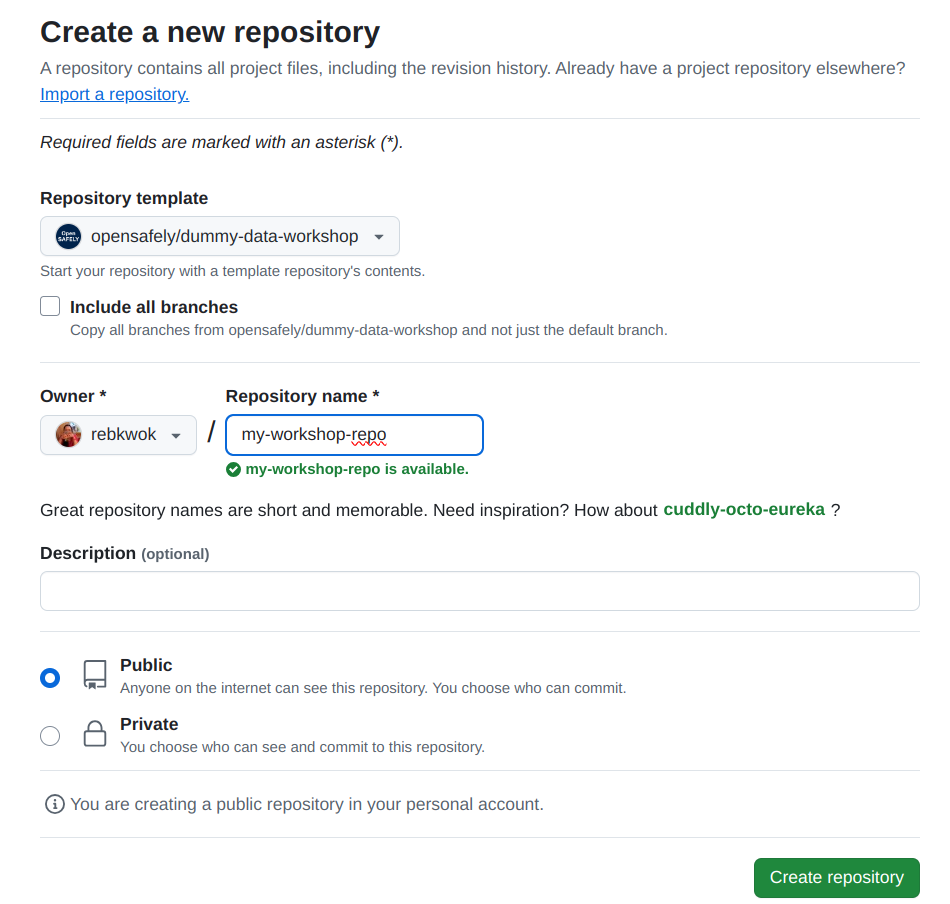
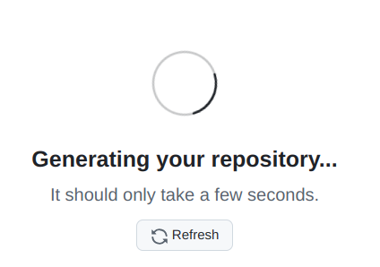
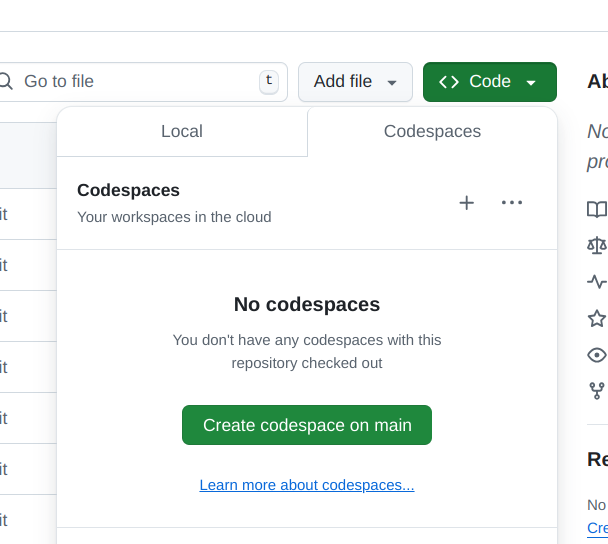

# Welcome to the workshop

Go to <https://opensafely.github.io/dummy-data-workshop> to follow along.

## Prerequisites

### GitHub and Codespaces

We will use a GitHub repository and [Codespace](https://github.com/features/codespaces)
for this workshop. You will need a personal [GitHub account](https://github.com). Follow the instructions
to [setup your codespace](#setup-your-codespace).

### ehrql 
The ehrQL code that we'll look at in this workshop is not very complicated,
however, it is assumed that you are not *completely* new to ehrQL. If you
need a reminder, please see the [ehrQL cheat sheet](https://docs.opensafely.org/ehrql/reference/cheatsheet) and the 
[ehrql documentation](https://docs.opensafely.org/ehrql).

### R
Some previous experience writing code in R is recommended.

## Setup your codespace

Please go to <https://github.com/opensafely/dummy-data-workshop/generate> to create a new repository from
the workshop repo. Choose any repository name, and click Create repository. 

Wait for your repo to be generated.

When your new repo loads:

1. Click the Code button.
1. Click the Codespaces tab.
1. Click the "Create codespace on main".

You may see a page requesting additional permissions on `opensafely/server-instructions`. If so, click "Authorize and continue".

The codespace will take a few minutes to launch. Please wait!

## Saving changes to your repo

If you make changes to your repo during the workshop that you would like to keep, you
will need to commit and push the changes to GitHub.  Follow the [instructions in the
OpenSAFELY tutorial](https://docs.opensafely.org/getting-started/tutorial/publish-the-changes-to-github/)
for a guide on how to do that.

## Notes

We'll use some icons in parts of this workshop:

:fontawesome-solid-code: For when we're looking at or modifying some code in a file.

:octicons-terminal-16: For when we need to run a command in the terminal

!!! example "Suggested exercises"
    Blocks like this indication suggested exercises to try, or ways to experiment; we won't
    necessarily have time to go through these during the workshop, but you might want
    to come back to them in the time at the end of the session, or afterwards.
